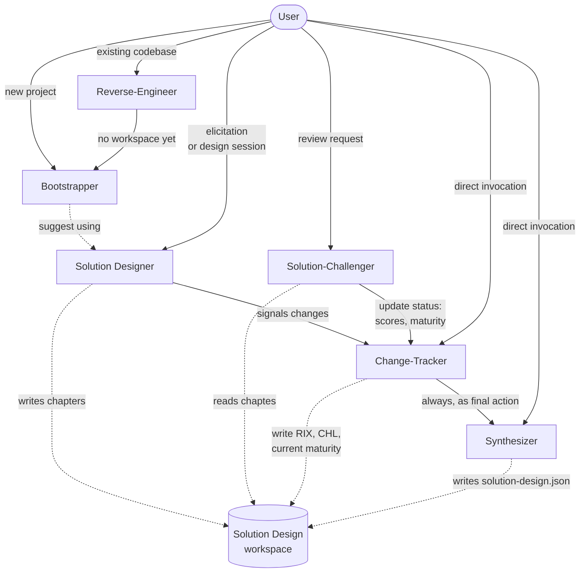

# DoxOps

On this page you can find a list of the available **Dox/Dox9+ agents** and some information on how to use them in your own projects.

## Dox Assistant

You can use the **[Dox Assistant](./skills/dox-assistant/SKILL.md)** agent to help you write and maintain any type of specification in Dox notation, in standalone mode. The next section gives some hints on how to install and use it.

### Getting Started

If you use Claude Desktop, you can install the [dox-assistant.zip](./assets/dox-assistant.zip) directly from the UI. The archive contains the SKILL.md file and the Dox specification, which the agent uses as its source of truth.

If you work with Claude Code, you should:

1. Copy the [`dox-assistant`](./skills/dox-assistant) folder into your `.claude/skills/`
2. Add the [latest Dox.md](./Dox.md) specification to the `dox-assistant` folder.

This should work with any other agent of your choice, with minor configuration adjustments.

It's recommended to use the `.dox.md` format for your specification files, so that the Dox Assistant can easily recognize them.

## Dox9+ Agents

:warning: **Note: The agents and process described below are still early-stage and have received limited testing.**

This is meant to be the agentic layer of the Dox9+ Framework, providing a set of skills that support the full lifecycle of a Solution Design document: from initial workspace setup, through requirement elicitation and design, to validation, maintenance, and synthesis.

Each agent has a well-defined responsibility and interacts with the others in a structured way. Some invocations are triggered by the user; others are automatic, agent-to-agent, as part of a synchronization chain.

- **[Dox9+ Bootstrapper](./skills/dox9-bootstrapper/SKILL.md)**. Initializes a new Dox9+ Solution Design workspace from the official template, stripped of placeholder content and ready to be filled in. Can also be re-invoked later to change the maturity model, chapter ordering, or optional chapter set.

- **[Dox9+ Reverse-Engineer](./skills/dox9-reverse-engineer/SKILL.md)**. Reconstructs a Dox9+ Solution Design retroactively from an existing codebase, inferring architecture, interfaces, and — where plausible signals exist — functional and business context, clearly flagged for validation.

- **[Dox9+ Solution-Designer](./skills/dox9-solution-designer/SKILL.md)** Guides requirement elicitation and design, following the Dox9+ logical flow (business → product → technical requirements), with an active technical solution architect's point of view. Can ingest existing documentation to bootstrap elicitation.
  
- **[Dox9+ Solution-Challenger](./skills/dox9-solution-challenger/SKILL.md)**. Critically evaluates a Solution Design for completeness, consistency, and technical soundness. Assigns a 1-10 score per chapter and computes the document's actual maturity level.

- **[Dox9+ Change-Tracker](./skills/dox9-change-tracker/SKILL.md)**. Mechanically resynchronizes, after relevant changes to a Solution Design, the Requirements Index, Changelog and current maturity level. Always invokes the Synthesizer as its final action.

- **[Dox9+ Synthesizer](./skills/dox9-synthesizer/SKILL.md)**. Produces a structured JSON overview of a Solution Design, acting as a machine-readable registry record for the project.

### Getting Started

To use the Dox9+ agents in your project, the following steps are recommended:

1. Copy the `.dox` folder into your project root. You can then delete the `assets` folder inside `.dox`
2. Instruct Claude Code (or any other agent of your choice) to look for skills inside `.dox/skills/`. You should be able to do this by embedding the contents of [SAMPLE-CLAUDE.md](./skills/SAMPLE-CLAUDE.md) into the CLAUDE.md (or AGENTS.md) file inside your project root. You can then delete the `SAMPLE-CLAUDE.md` file inside `.dox/skills/`
3. Start with the Bootstrapper agent, which creates a `solution-design/` workspace with an empty, ready-to-fill Dox9+ template inside
4. From there, use the other agents to support the writing, maintenance and evaluation of your project's Solution Design — see the process described below.

### Usage & Process

The diagram below shows the ideal Dox9+ workflow: solid arrows represent user-triggered or agent-to-agent invocations, dashed arrows represent other operations.

## Common Use Cases

### Standalone usage

The user invokes the Dox Assistant, which can help write and maintain any type of specification in Dox notation. The Dox9+ template and related agents are not required in this case. The agent can be used as a conceptual aid while writing a specification or designing a solution.

### Starting a blank Dox9+ project

The user invokes the Bootstrapper, which creates the workspace. The Solution-Designer is then invoked to begin elicitation. After each relevant session, the Solution Designer signals the Change-Tracker, which resynchronizes RIX and CHL, then automatically invokes the Synthesizer.

### Starting from an existing codebase

The user invokes the Reverse-Engineer, which inspects the repository and populates technical chapters (and where possible functional and business chapters, clearly flagged for validation). If no workspace exists yet, the Reverse-Engineer asks for confirmation before invoking the Bootstrapper. Afterward, the Solution-Designer or Solution-Challenger are recommended to evaluate, validate and refine the reconstructed content.

### Periodic quality review

The user invokes the Solution-Challenger at any point. It evaluates the document, scores each chapter, and computes the actual maturity level. It then passes this delta to the Change-Tracker, which updates the cover page's current maturity, RIX and CHL accordingly, and invokes the Synthesizer to keep the JSON registry current.

## License

The DoxOps agents and related assets are distributed under CC BY-SA 4.0 — see [LICENSE.md](./LICENSE.md) file.
