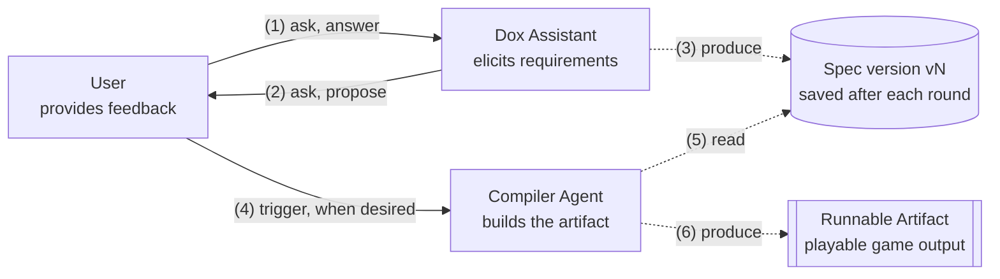
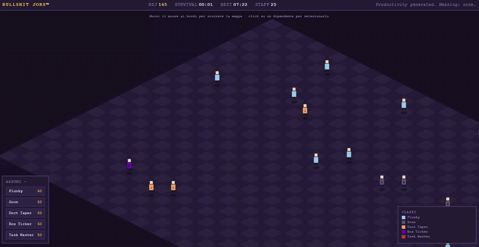
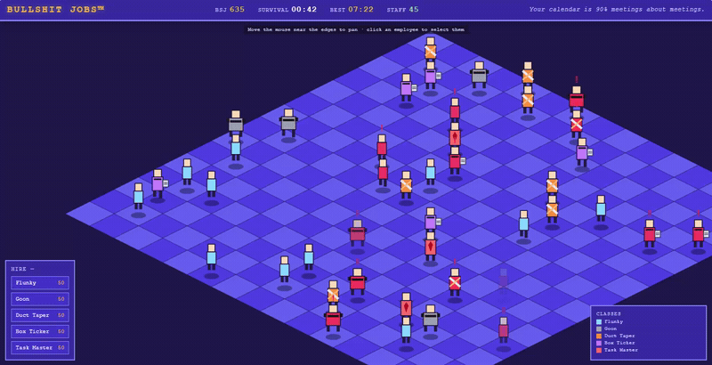

# Vibecoding a browser-game PoC in less than 3 hours, aided by Dox

> ✨ This article was drafted and translated into English with the help of an AI. The content and related assets originate from the author's own ideas and experiences.

## Table of Contents

1. [Introduction](#introduction)
2. [Methodology](#methodology)
3. [The BSJ Game](#the-bsj-game)
4. [Iteration 1: Baseline](#iteration-1-baseline)
5. [Iteration 2: Cosmetics and Afterthoughts](#iteration-2-cosmetics-and-afterthoughts)
6. [Iteration 3: Better Gameplay](#iteration-3-better-gameplay)
7. [Final Notes](#final-notes)

## Introduction

In the [previous article](https://github.com/efchi/dox9plus/blob/main/.pub/introducing-dox.md) I introduced **[Dox](https://github.com/efchi/dox9plus/tree/main)**, a notation I created to support AI-assisted specification for my hobby projects, aiming to keep some structure and control over requirements and design choices.

These days, there is a lot of interest in how agents can solve technical problems through autonomous or automatic programming. The possibility of building anything without knowing how to code feels like magic, and is a real game changer for the industry and discipline in general.

Still, one of the most valuable use cases for LLMs is also the one most overlooked, and it happens to sit at the very heart of the design process: requirement elicitation, specification, and tracking.

In this article, I'm going to describe how I concretely used the [Dox notation](https://github.com/efchi/dox9plus/blob/main/.dox/Dox.md) to support the creation of a small toy project — a browser-game PoC, entirely vibecoded using Claude Desktop.

## Methodology

With the help of the [Dox Assistant](https://github.com/efchi/dox9plus/blob/main/.dox/DoxOps.md#dox-assistant) skill, I set up a **continuous elicitation loop** shown in the diagram below. It's a short feedback cycle that keeps improving the product, iteration after iteration, up to the desired level of completeness.

At time 0, we start with an empty specification. Then, at each iteration, the agent asks questions. When we're satisfied with the solution we've found, we edit the specification file and version it. Each iteration produces the input for the next round.

At each iteration, we can also choose to turn our intermediate specification into a concrete output: our code artifact. This is somewhat similar to what a compiler does: producing low-level code (the implementation) from high-level code (our specification).

The overall value doesn't come just from the artifact itself, but also from having a **reference specification** produced through a constructive back-and-forth with the LLM, enabling actual control over the solution we're designing. When vibecoding, we still have to stay aware of the choices and trade-offs being made, because the software will always ultimately be our responsibility (not the agent's).

LLMs can help with exactly that: asking the right questions, making and tracking decisions, raising doubts about things we don't yet know, producing and maintaining a reliable source of truth to ensure consistency and control over time.

This approach offers another advantage: a specification could be **replayable** — meaning we should be able to compile it twice and expect a similar functional result. Of course, the implementation itself won't be fully deterministic, since LLMs aren't either, and it will carry some variability. But a well-written spec, covering the right level of detail, at least lets us establish some **fixed points of coherence** that our agents should respect when crunching their (and our) code.

## The BSJ Game

For this toy project, I took inspiration from David Graeber's [Bullshit Jobs](https://en.wikipedia.org/wiki/Bullshit_Jobs), and called it *BSJ*. 

Our game is set inside a corporation: you play as the CEO, and you get to manage five classes of unfortunate employees:

- *Flunkies* — low individual value, but they're what keeps morale up. They strongly raise the happiness of everyone around them;

- *Goons* — high output on paper, toxic to be around. They generate real currency, but lower their neighbors' happiness;

- *Duct Tapers* — the actual glue holding the place together. They don't generate much value, but stabilize the happiness of everyone nearby;

- *Box Tickers* — pure overhead. They cost money to keep around and contribute exactly nothing to anyone's happiness;

- *Task Masters* — genuinely productive, and everyone pays the emotional price for it: high value, but they strongly tank neighboring happiness.

The goal is simply to keep the company alive for as long as possible. 

Employees whose happiness stays too low for too long eventually burn out and quit. The game is a simulation on an isometric map: every character has a happiness score, interactions between neighboring employees push that score up or down depending on their classes, and as the CEO you spend a currency (BSJ) to hire new employees or fire existing ones.

There's no real point going deeper into the mechanics here: they're intentionally trivial, as the goal is not to make an actual fun game. Let's dive into the process.

## Iteration 1: Baseline

I usually start with a blank specification, and this project was no exception. The first step is to engage the agent, describing your intent to use it as an assistant for your project.

> Hi Claude, I have a new project in mind. Use the Dox Assistant skill to help me ground the requirements and turn the idea into a concrete solution.

From there, the agent starts eliciting information, asking questions. This is the part where you describe a rough draft — the idea that's still just floating around in your head and needs to be teased out into something concrete.

After a round of questions covering both the functional side (game mechanics) and the technical requirements (implementation) I arrived at a first version of the spec. I then asked the agent to follow the specification we'd just put together and **build the game**. In this case, the target was a self-contained HTML/JS artifact.

> I prepared a Dox specification (attached) with the help of the Dox Assistant skill. I want you to read it and fully understand it, along with the foundational Dox notation and conventions, and then implement the PoC following all the indications and requirements contained in the spec.

Here's an image showing our first attempt.

What I didn't expect: the game worked without a single bug on the first try. 
The agent correctly implemented all the requested functionality — the isometric canvas, the five employee classes, the happiness/currency simulation loop, hiring and firing, all of it. 

What it lacked was any sense of style: a dark palette, a map too large to read comfortably, and an ugly HUD.

## Iteration 2: Cosmetics and Afterthoughts

After an initial implementation, I moved into a **refinement phase**, going back to fix the things I wasn't happy with in the first output.

This part is where most of the back-and-forth happened, and it's a good example of what tracking decisions actually buys you. In fact, several requirements went one way and then got reversed in the next iteration — all of it captured in a changelog appended to the specification.

Working **delta by delta** on the spec, here's what the agent and I did:

- Switched the UI and the spec itself to English (since it's not my native language);

- Shrank the map down to a readable 15×15, and replaced the dark palette with a much brighter, higher-saturation one, along with an overall HUD pass (fonts, sizing, colors);

- Experimented with character movement — first specifying discrete, cell-to-cell jumps with no interpolation, then walking that back to smooth continuous gliding once it turned out to look and feel better in practice;

- Did the same with zoom: introduced a toggle between 100% and 200%, dialed the maximum down to 150%, and eventually removed the toggle altogether in favor of a single fixed zoom level;

- Tightened the camera panning and redesigned the side menus, moving currency and staff count into their own dedicated panel;

- Rebuilt the character sprites using pre-rendered pixel art instead of plain vector shapes.

Finally, we versioned the spec and compiled a second build of the game. Here's the outcome: way better!

Nicer graphics and UX, but still a bit boring to play. Let's try to add some interactivity.

## Iteration 3: Better Gameplay

For the final pass, I asked the agent directly what it would add, from a mechanics and interaction standpoint, to make the game more engaging. It came back with a menu of options, from which I picked the ones I liked, and threw in a few ideas of my own on top. 

What we ended up adding:

- Two new CEO actions, *Pep Talk* and *Free Pizza Friday*, both instant happiness boosts at a currency cost, the second one company-wide and on a cooldown;

- Manual placement when hiring: you now click the tile you want your new employee on, instead of it spawning at random;

- A visual overlay of each selected character's adjacency effects on its neighbors;

- A small pool of random two-choice events (a compliance audit, a viral LinkedIn post, a surprise reorg, and so on) that pause the simulation while you decide;

- A difficulty curve: happiness decay now ramps up gradually over a run instead of staying flat, so the pressure genuinely builds the longer you survive;

- Minor interface and gameplay fixes.

Here's the final version of the game.

Far from perfect, but a bit more interactive and enjoyable.

## Final Notes

The full Dox specification for this toy project is available [here](./assets/spec-final.dox.md), and the final version of the game is available [here](./assets/game-final.html) as a self-contained HTML file.

Despite being a simple and no-frills hobby project, if I'd written the game myself, it would probably have taken days, especially considering I have poor game development experience. The whole process took about three hours instead, and most of that time was inactive (in the sense that I was doing something else while the agent was working).

Overall, I'm quite happy with the results I'm getting from using Dox as a **structured approach to AI-powered software design**, and I'll definitely keep using it for more substantial projects.

To sum up, this methodology supports three main use cases:

1. Drafting a *compilation source* to build full artifacts (eg. our HTML/JS);
2. Keeping an informative context as a reference for incremental changes (or analysis of existing solutions);
3. Establishing a means to keep control over the code LLMs produce.

Thank you for reading this far! If you want to see how the underlying notation works, please check out the [introductory article](https://github.com/efchi/dox9plus/blob/main/.pub/introducing-dox.md). And if you try Dox on one of your own projects, let me know — I'd love to hear about it.
